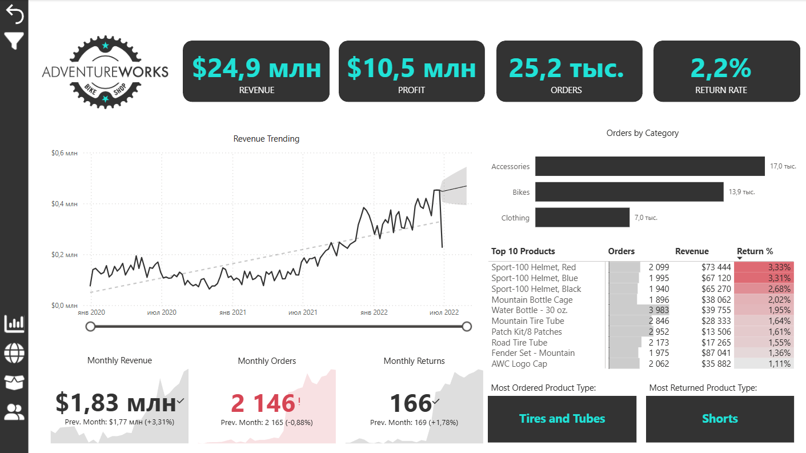
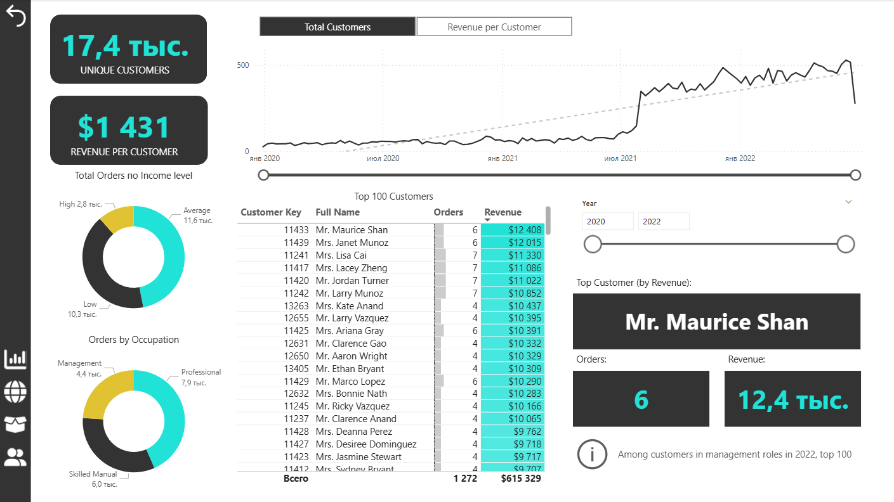
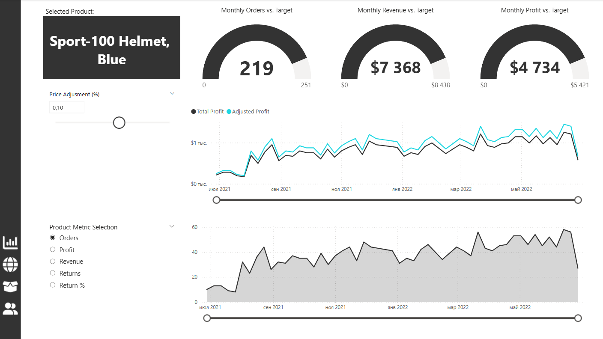
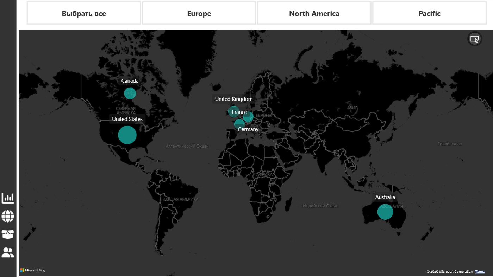

# 🚴 Bike Shop Sales Dashboard (Power BI)

This project is a data analysis and visualization of a bike shop sales dataset built using Power BI.  
It focuses on transforming raw transactional data into actionable business insights through data modeling and interactive dashboards.

The analysis covers key areas such as sales performance, customer behavior, product efficiency, and regional distribution.  
The dataset is based on AdventureWorks sales data and includes multiple related tables (sales, customers, products, categories, returns, and geography) stored in CSV format, which were integrated into a unified data model.

Using Power BI, relationships between tables were established, calculated measures (e.g., revenue, profit, return rate) were created, and dynamic dashboards were built to track KPIs, identify trends over time, and evaluate product and customer performance.

The project simulates real-world business analysis scenarios and demonstrates the ability to work with structured data, build data models, and present insights in a clear and interactive way.

---

## 📊 Project Overview

The goal of this project is to transform raw CSV data into meaningful business insights using Power BI.

Key areas of analysis:
- Sales performance
- Customer behavior
- Product analysis
- Geographic insights

---

## 💡 Key Insights

- A small group of products generates most of the revenue  
- Sales vary significantly by region  
- Customer behavior differs across segments  
- Certain categories outperform others consistently  

---

## 🛠️ Tools Used

- Power BI (data modeling & visualization)
- CSV (data source)

---

## 📂 Dataset

The dataset consists of multiple CSV files:

- Sales data (2020–2022)
- Customers
- Products
- Categories & Subcategories
- Returns
- Territory data
- Calendar data

These files were used to build a data model inside Power BI.

---

## 📈 Dashboard Pages

### 1. Executive Dashboard
- Key KPIs
- Orders by Category
- Top Products
- Revenue Trending

### 2. Customer Analysis
- Customer distribution
- Purchase behavior
- Top Customers

### 3. Product Analysis
- Dynamic Metric Selection
- Profit Trend Over Time
- Price Adjustment Simulation

### 4. Geographic Analysis
- Sales by region
- Map visualization

---

## 🖼️ Dashboard Preview

### Executive Dashboard

### Customer Analysis

### Product Analysis

### Map

---
